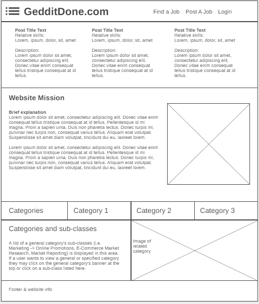

# GedditDone

# Link to Application
[Link](https://gedditdone.herokuapp.com/)

# Description
This is an application that connects employers and job seekers. This app will allow the employers to view a list of services that job seekers provide. The employers may connect with the job seeker by the email provided on their service post. 
The job seekers will be able to create an account profile, which will include a current photo of themselves. This will help the employer to identify who they are hiring once they show up to the work location. 
The job seeker will complete a list of questions and fill out the type of service they provide. This will include job title, experience level, a list of skills, their contact email address, and the cost of the service either by task or per hour. The job seeker will also be able to select if their services are for residential, business, or both.  

# User Story
As a freelance job seeker,
I want to easily apply for general labor job postings
so that I can develop a network of employers and generate a source of
income.

# Wireframe/Outline

</img>
GedditDone-Homepage

	Marketing-Quotes
		“Looking for someone to help you with landscaping?”
		“Maybe you need a babysitter?”
		“How about someone to paint your house?”
User/Employer- may search for someone to hire for the service they need help with by using keywords.(The app will provide a search/input box.)

	Marketing-Quotes
		“Are you trying to make extra cash?”
		“Do you have any special skills that you would like to put to    use?”
		“Want to polish your skills?”
User/Job Seeker- may sigUp/Create an account and post the services they provide. This will include the service, description, any special skills, rate per task or per hour, may also be able to upload a profile photo of themselves, and a contact email address.

GedditDone-Job Listings Page
    This will show the posts created by job seekers for employers to view and decide if they would like to hire the job seeker. This will contain the service, description, rate, job seeker email address, and hopefully a job seeker photo that will be able to aid the employer to put a face to the name. 

GedditDone- SigUp Page
    The user will have to input their full name, email address, and password to create an account. 

GedditDone- LogIn Page
    The user will input their logIn information: username and password to access the post/create or post/edit page. 
Geddit- Post Create Page

GedditDone-Post Update Page

GedditDone- Post Delete Page

# Tasks Breakdown
Hanna:  Models-User, Routes-Index, View-All(TBD) 
Triston:    Models-Jobs, Routes-User, View-All(TBD) 
Myrla:  Models-Index, Routes-Jobs, View-All(TBD) 
